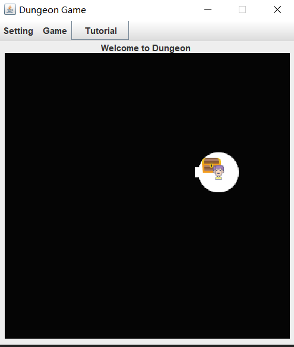

###### **About/Overview**

The world for our game consists of controller and a dungeon, a network of tunnels and caves that are interconnected so that player can explore the entire world by travelling from cave to cave through the tunnels that connect them.The entire project are separated into 3 section:
1. 7 packages
2. diver class
3. test class

###### **List of features:**
1. create a GUI game of Dungeon
2. navigate in the dungeon by arrow key
3. navigate in the dungeon by mouse click
4. restart the game in original setting or new one
5. present monster/treasure/exit/player in the dungeon
6. shoot arrow by button or key press
7. pick treasure by button or key press
8. find player info by button

//////////////////////////////////////////////////
1. create a CMD game of Dungeon
2. create new dungeon
3. create new player
4. add treasure into dungeon
5. print the sign of player and dungeon
6. move around the dungeon
7. kill monster in dungeon
8. pick treasures to player
9. leave the game at the end to win
10. get killed by monster to lose
11. user is able to type in Terminal to do feature between 6-9

###### **How To Run:**

####1. How to run the jar file

#####press enter in the console for an GUI game:

    cmd : java -jar project3.jar

#####press enter in the console for an unwrapped game, user shoot 2 arrow kill a monster and evade a damaged monster (hit by one arrow) attack (50% chance evading). Player will Pick treasure and arrow reach the end of dungeon and leave the game with win.

    cmd : java -jar project3.jar 3 3 0 false 100 10 0 0 0 0 0 0 0 0 0 0 0 0 0 0 0 0 0 0 0 0 0 0 0 0 0 0 0 0 0 0 0 0 0 P M N M N S E 1 M E P M S S S 1 S S 1 M S L

#####press enter in the console for a wrapped game, plyer is going to be eaten by monster.

    cmd : java -jar project3.jar 3 4 1 true 100 10 0 0 0 0 0 0 0 0 0 0 0 0 0 0 0 0 0 0 0 0 0 0 0 0 0 0 0 0 0 0 0 0 0 0 0 0 0 0 0 0 0 0 0 0 0 0 0 0 0 0 0 0 0 0 0 0 0 M N m n   

####2. What arguments are needed (if any) to run the jar file, what are they mean
#####GUI Game:
    Noting is needed

#####CMD Game:
    From left to right first 6 index :"3 3 0 false 100 10" row/column/treasure/testMode disabled/ num of monster.
    The all digit index after 6thb until letter input will be the random number stack. Every input after random number stack input will be the player command input.

###### **How to Use the Program:**
**GUI game:**
1. Press arrow key or click board to move
2. use menu bar or press p to pick treasure
3. use menu bar or press s to shoot
4. use menu bar or press l to win at the exit
5. use menu bar or press R to restart the game
6. use menu bar to display player info
7. use menu bar to start a new game with different setting

**CMD game:**
1. create the game interface by commandline with 6 parameter
2. use terminal to navigate through dungeon or shoot or pick treasure
3. move the current location by move in game interface
4. let player pick treasure by pick
5. find the end
6. leave at the end
7. Press Q to quit the game
8. Press M and (N,W,E,S) to move around the dungeon
9. Press L at the end to win the game
10. Press S and  (N,W,E,S) and (int postive) to shoot arrow
11. Press P to pick treasure

###### **Description of Examples**

projecte.jar
Run 1 -- 

Run 2 -- output1.txt:
1. This is base on the wrapped game.
2. read commandline input to create a 3x3 dungeon with 1 interconnectivity and 0 treasure
3. move to the end and display the process

Run 3 -- output2.txt:
1. This is base on the unwrapped game.
2. read commandline input to create a 3x3 dungeon with 1 interconnectivity and 100 treasure
3. move to the end and pick treasure to player and display the process

###### **Design/Model Changes:**
The Diagram is now contains both project 3, 4, 5.

There are more jpanel subclass to help to create the GUI.
KeyBoardlistener, actionlisterner, clickAdapter are added to handle model.
Driver method can handle exception right now.
The random test mode is redesign to allow a stack and store expect return.
The design by "switch" in ElementNode is changed to a Map.
The toSign in dungeon will not show the id but type of cave or tunnel.

###### **Assumptions**

Arrow is a kind of Treasure
Player is force to pick up ever treasure and arrow in a caves
Each dungeon cave will have the same amount of treasure one kind for each.
Monster can only damage player when he moves to that caves.
Player can keep playing or leave the dungeon to win during a game.
Player can quit during a game play.
if player shoot an arrow in a tunnel at the wall, it will not pass.
Player can shoot no. caves from 0 to positive infinity.
Player only allow to enter M/S/P during game and N/S/W/E for direction.

###### **Limitations**
There is only one type of treasure icon
all or none treasures will be added in to a room
Resize game will disable any test mode in the game
Restart the game will keep the test mode

###### **Citations**
For adding Image into the jar file
https://stackoverflow.com/questions/1096398/add-image-to-jar-java
